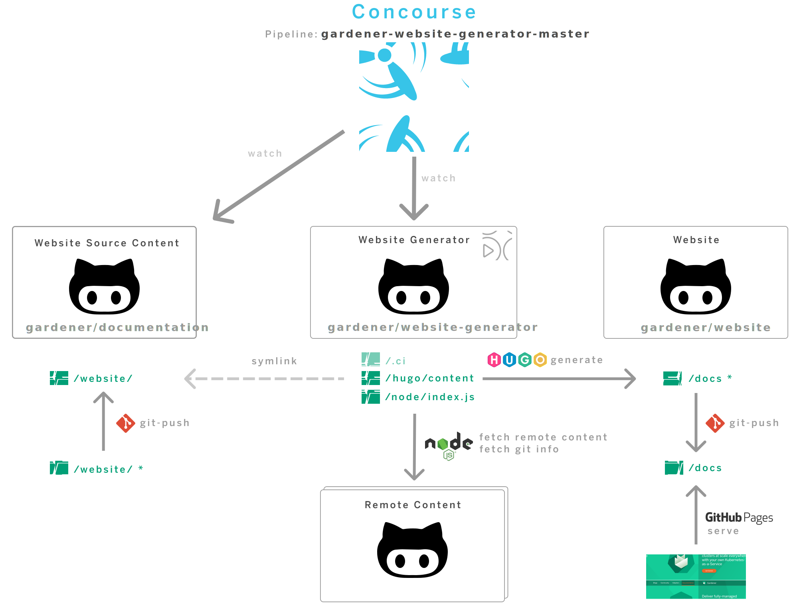

# Gardener Website Generator

[](https://api.reuse.software/info/github.com/gardener/website-generator)

This repository is wired via CI/CD and scripts to listen to component dependencies and upon their release to build a new version of the documentation for them and publish it. 

## Website Build/Publish Overview



The repositories involved in the process are:
- [/gardener/website-generator](https://github.com/gardener/website-generator) (this repository). It contains the CI/CD pipeline definition and related scripts, configuration for building the website with HUGO, including all common framework html, styles, javascript and images, as well as the scripts and build configuration for the build environment container image.
- [/gardener/component](https://github.com/gardener/documentation/) is any repository in the Gardener organization contributing Docforge documentation manifest, for which /gardener/website-generator is configured to listen for releases. The repository [/gardener/documentation](https://github.com/gardener/documentation/) is one such example. It contains source content for the website, used by the builder to produce the static HTML to be served. 
  > Currently, [/gardener/documentation](https://github.com/gardener/documentation/) is configured to deliver the Gardener (cross-component) documentation along with the other website content assets (blogs/adopters/community), but it is transitioning to a repository dedicated to only crosscutting documentation, such as tutorials and website content. The [Gardener repository](https://github.com/gardener/gardener) will be configured to contribute its own documentation upon release. All other components wil follow using the same scheme depicted on the diagram.
- [/gardener/website](https://github.com/gardener/website/) is the home repository for the https://gradener.cloud website. It hosts the website content produced by the website-generator and is configured to have it served by GitHub Pages.

The website builds and deployments are orchestrated by Concourse CI/CD [pipeline](https://concourse.ci.gardener.cloud/teams/gardener/pipelines/gardener-website-generator-master) and triggered upon depending component release or upon changes in [/gardener/documentation](https://github.com/gardener/documentation) or [/gardener/website-generator](https://github.com/gardener/website-generator) repositories. The build results are then pushed to [/gardener/website/docs](https://github.com/gardener/website/tree/master/docs) and served as a [GitHub Pages](https://pages.github.com/) site.


## Build Locally

### Overview

Creating a local version of Docforge will allow you to preview changes you have made to the site locally, without the need to use GitHub UI. 

### Prerequisites

Before you can setup your local version of the website, you need to have:
* [Git](https://git-scm.com/)
* [GoLang](https://golang.org/dl/)
* [Docforge](https://github.com/gardener/docforge#installation)
* [Extended version of Hugo](https://gohugo.io/getting-started/quick-start/)
* [NodeJS](https://nodejs.org/en/)/[NPM](https://www.npmjs.com/get-npm)
* [GitHub token](https://docs.github.com/en/authentication/keeping-your-account-and-data-secure/creating-a-personal-access-token)

### Setup

1. Clone the repository and go to the repo's directory.
2. Enter `git submodule update --init --recursive`.
3. Export the following environment variables:

   `export GIT_OAUTH_TOKEN=<token>`

4. Run `npm install` in `hugo` and `hugo/themes/docsy` 

### Build Website

1. Run `make build` command

2. Run `cd hugo && hugo serve`

### Test Local Changes

In order to test local changes, for example [gardener/documentation](https://github.com/gardener/documentation/) changes, you need to go trough the following steps:

1. Clone the repository where you will do the changes. We will take for example [gardener/documentation](https://github.com/gardener/documentation/).
2. Make the wanted changes there.
3. Create `${HOME}/.docforge/config` file with the following content in it:

   ```yaml
   resourceMappings:
     https://github.com/gardener/documentation: <Path to the cloned documentation repo>
   ```
4. Run `make build`
5. Run `cd hugo && hugo serve`
